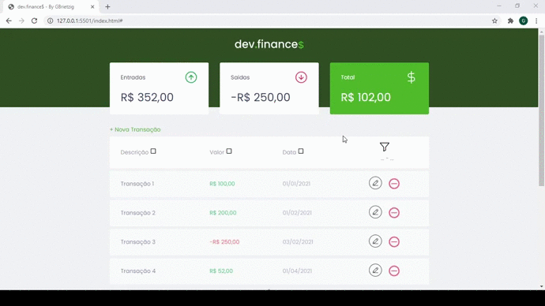
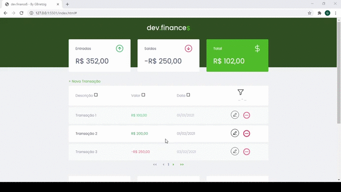
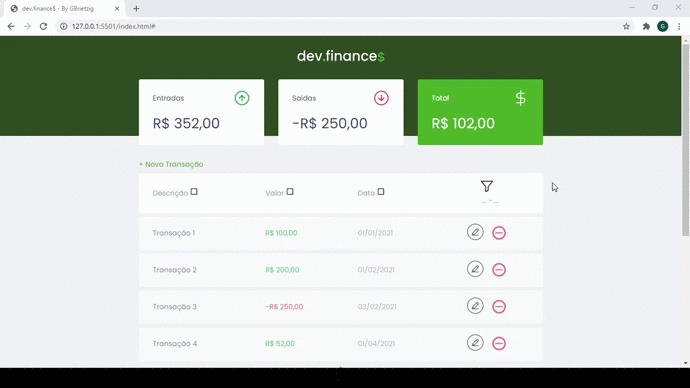

  <a href="#-projeto">Projeto</a>&nbsp;&nbsp;&nbsp;|&nbsp;&nbsp;&nbsp;
  <a href="#-tecnologias">Tecnologias</a>&nbsp;&nbsp;&nbsp;|&nbsp;&nbsp;&nbsp;
  <a href="#-implementações">Implementações</a>&nbsp;&nbsp;&nbsp;|&nbsp;&nbsp;&nbsp;
  <a href="#-layout">Layout</a>&nbsp;&nbsp;&nbsp;|&nbsp;&nbsp;&nbsp;
  <a href="#memo-licença">Licença</a>

  

 

## 💻 Projeto

O dev.finances é uma aplicação de controle financeiro desenvolvida através da Maratona Discover, uma iniciativa da Rocketseat. Nessa aplicação é possível cadastrar e excluir transações e ver o saldo de entrada e saída 💰

## 🚀 Tecnologias

Esse projeto foi desenvolvido com as seguintes tecnologias:

- HTML
- CSS
- JavaScript

## 💡 Implementações

- [X] Filtro por período;
- [X] Paginação;
- [X] Seleção de itens por página;
- [X] Gráficos;
- [X] Ordenação;
- [X] Transação parcelada;
- [X] Edição;
- [ ] Alteração de tema;

Filtro por período</a>

Com esse recurso o usuário pode selecionar uma data mínima, uma data máxima ou um período do qual ele quer analisar as transações.

Paginação</a>

Com esse recurso o usuário pode navegar entre várias páginas de transações.

Seleção de itens por página</a>

Com esse recurso o usuário pode escolher quantas transações deseja por página. O valor padrão é 15 transações por página.

Gráficos</a>

Com esse recurso o usuário pode visualizar as 5 maiores entradas e saídas e a porcentagem que cada uma representa do grupo. Um terceiro gráfico mostra a saúde financeira da carteira.

Transação parcelada</a>

Com esse recurso o usuário pode gerar várias transações ao mesmo tempo, sendo que elas vão se repetir com os mesmos dados adicionando um mês por parcela. Caso o dia selecionado inicialmente seja o dia 31 o parcelamento será cadastrada para o último dia de cada mês.

Edição</a>

Com esse recurso o usuário pode editar transações já existentes.

Você pode visualizar o layout do projeto através [desse link](https://www.figma.com/file/7Vu9DzUaCZIV4nibzkjgB4/dev.finance%24-Maratona-Discover). É necessário ter conta no [Figma](https://figma.com) para acessá-lo.

## :memo: Licença

Esse projeto está sob a licença MIT. Veja o arquivo [LICENSE](LICENSE.md) para mais detalhes.

---

Feito com ♥ by Rocketseat :wave: [Participe da nossa comunidade!](https://discordapp.com/invite/gCRAFhc)
